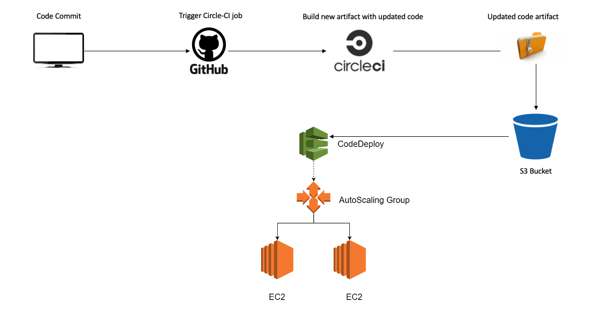
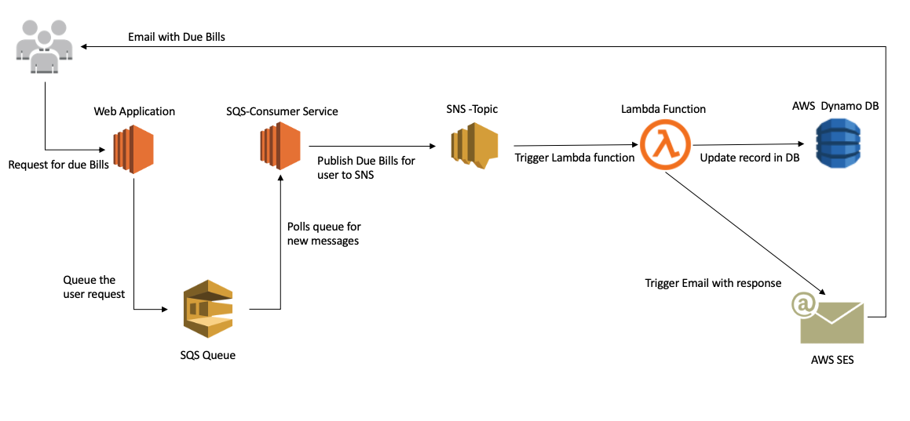

# AWSEC2-Deployment

## Deploying a web application on AWS-EC2

[Web Application Code Repository](https://github.com/taneja09/AWSEC2-WebAPP)

**Application Use Cases:**

* Application manages Billing invoices for the customer
* Users and Bills records are saved in MySQL RDS Instance
* Bill related files are uploaded to Amazon S3 bucket with lifecycle policy of 30 days
* Bill file metadata is stored in RDS Instance itself for retrieval purpose
* User receives his due bills in email via AWS Simple email service

**Tools and Technologies**

  <table>
    <thead>
      <tr>
        <th>Category</th>
        <th>AWS Services & Technologies</th>
      </tr>
    </thead>
    <tbody>
        <tr>
            <td>Web Application</td>
            <td>NodeJS, MySQL, Sequelize ORM, Express, Shell Scripts, AWS-SDK, ES6</td>
        </tr>
        <tr>
            <td>Infrastructure</td>
            <td>VPC, ELB, ASG, RDS, Lambda, DynamoDB, Route53, Cloud formation</td>
        </tr>
         <tr>
            <td>Metrics & Logging Service</td>
            <td>statsD, AWS Cloud-Watch, Log4js, Cloud-Watch Alarm </td>
        </tr>
         <tr>
            <td>Queue & Notification Mechanism</td>
            <td>SQS, SNS, Lambda, SES, </td>
        </tr>
          <tr>
            <td>CI/CD Pipeline</td>
            <td>Circle CI, AWS Code Deploy, AMI Automation</td>
        </tr>
       <tr>
            <td>Security</td>
            <td>SSL/TLS , RDS Encryption</td>
        </tr>
    </tbody>
  </table>
  

## Architecture Design

## Infrastructure - Cloud Formation 

[Cloud Formation Repository](https://github.com/taneja09/AWS-ResourceAutomation)

* created custom VPC with network setup using cloud formation template
* Attached Load balancers, auto scaling groups, SES, SQS and SNS services
* Created necessary service roles and policies for AWS resources
* Implemented Lambda function for emailing service 

## CI/CD Pipeline - AMI - Hashicorp Packer

[HashiCorp Packer Code Repository](https://github.com/taneja09/AMIAutomation-HashiCorpPacker)

* Automated AMI creation using Hashicorp packer
* Created AMI template to share the image between multiple AWS accounts
* Created golden images by adding provisioners to boostrap instances with - NPM, Code deploy and Cloud watch agaent

## CI/CD Pipeline - AWS Code Deployment

* Integrated Github repository with Circle-CI for continuous Integration
* Bootstrapped circle CI container with docker image to run the test cases and generate new code artifact
* Artifact is copied to S3 bucket and code deployement is triggered on running instances of autoscaling group
* In-Place deployment configuration hooks are placed for routing the traffic during deployment

## Logging & Alerting - Cloud Watch Services

* Embedded statD to collect various metrics such as counter for APIs hits and API response time etc
* logged the info, errors and warnings using log4js and further mounted them in AWS cloud-watch for analysis
* Implemented CPU Utilization based alarms for changing number of instances in auto scaling group

## Serverless Computing - Lambda 

[Serverless Lambda Code Repository](https://github.com/taneja09/AWSLambda-Serverless)

* Implemented pub/sub mechanism with SNS and Lambda function
* user requesting for his due bills, puts a message onto the AWS SQS service
* SQS-Consumer in the application checks already existing entry for user in Dynamodb
* If no email has sent already, SQS consumer process the request and puts the response in SNS 
* Once message is published to SNS Topic, subscribed lambda function is trigged 
* Lambda delivers due bills email to requesting user and saves the entry in Dynamo DB with TTL of 60 minutes

# webapp

******* Billing & Invoicing System *******

API Impementation with `Node.js`
Programming language : `Javascript`

External Libraries used:
1. UUID - for generating id fields
2. Bcrypt - for hashing out the passwords
3. basic-auth - Authentication module 
4. tsscmp - comparing the values
5. Sequelize - ORM for Javascript
6. dotenv - to process the environment variables
7. mysql - dialect for sequelize 
8. mocha - for integration testing in java
9. fs - for file saving and removing file from server
10. express-fileupload - for file upload purpose

__Build & Deployment__
The application runs on AWS Cloud EC2 instance and is deployed via CircleCI pipe-line.
As sson as there is a merge take place to the webapp repository, the build gets triggered and deployment takes place in AWS account.

*Environemnt variables need to be configured in CircleCI pipeline are*

1. AWS_SECRET_KEY 
2. AWS_ACCESS_KEY
3. CODE_DEPLOY_BUCKET
4. AWS_REGION

**Command to import the SSL certificate for LoadBalancers**
`aws acm import-certificate --certificate fileb://prod_divyataneja_me.crt --private-key fileb://mykey.key --certificate-chain fileb://prod_divyataneja_me.ca-bundle`

**Run the appication locally**
=========================================

*Steps*
1. Clone the repos locally 
2. Install node modules - npm install
3. Local database variable need to be provided in config.js file
4. Provide the NODE_ENV=development to run appication with local database
5. Run following command  `node index.js NODE_ENV=development`

**Run the unit test cases**
`npm test`

`Author: Divya Taneja`  
`Email: taneja.di@northeastern.edu`

